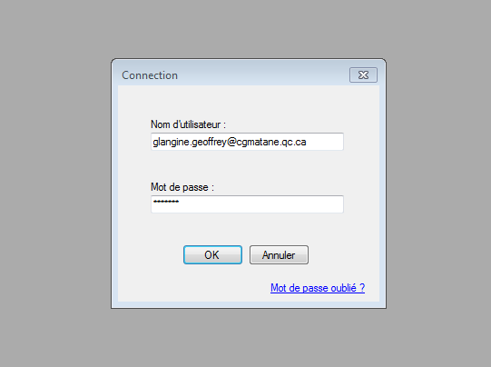
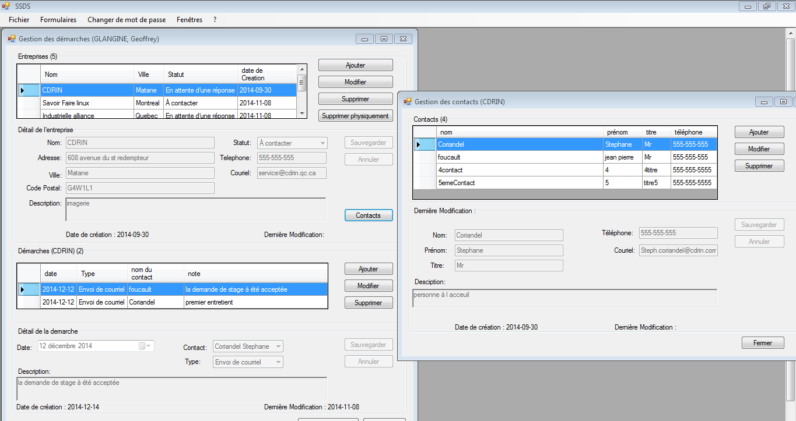
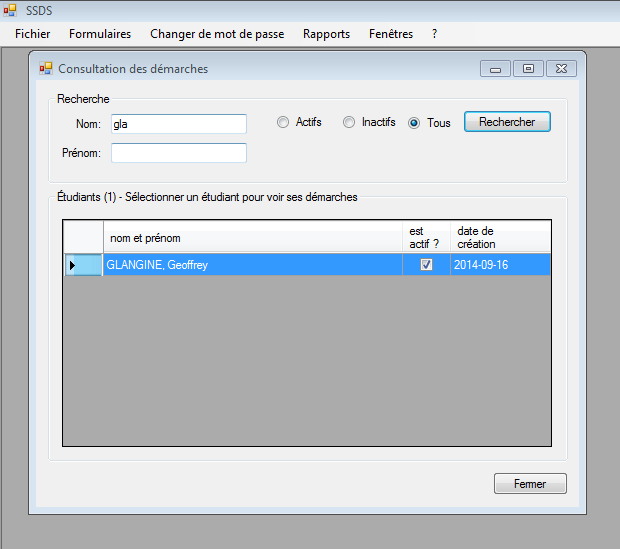
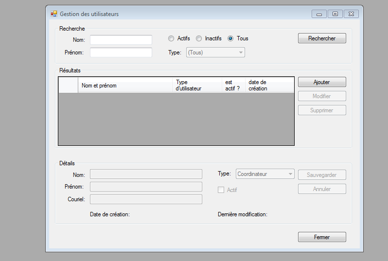
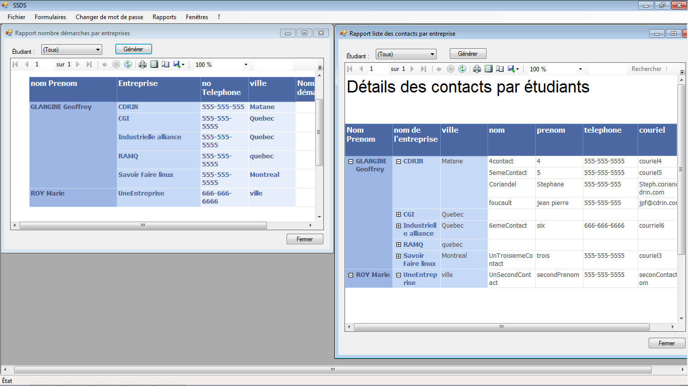
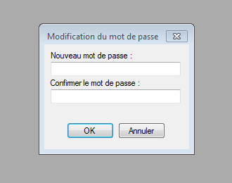

SolutionDeSuivitDesDemandesDeStages
===================================
SSDS est un logiciel de suivit des demandes des stages.
Il a été implémenté en VB.NET 

Fonctionnalités
----------------------
1) Interface pour les étudiant permetant de créer des demandes de stages, et de mettre un CV

2) Interface pour les proffesseurs permettant de visualiser les demandes de stages que les étudiants on fait et leurs CVs

3) Interface administrateur permettant de créer des utilisateurs

4) Les mots de passes sont générer aléatoirements lors de la création du compte et encryptés au format md5

5) possibilité de modifier son mot de passe ou de le réinitialiser si on l'a perdu.

Interface
-------------------------
Fenêtre de connection

Interface Utilisateur (Étudiant)

Interface Utilisateur (Enseignant)

L'enseignant peut rechercher un étudiant et quand il clique sur son nom, la fennetre de gestion des démarche de l'étudiant s'ouvre en lecture seule.

Interface Utilisateur (admin)

Des rapports peuvent aussi être imprimer par les enseignants :

Changement du mot de passe 

